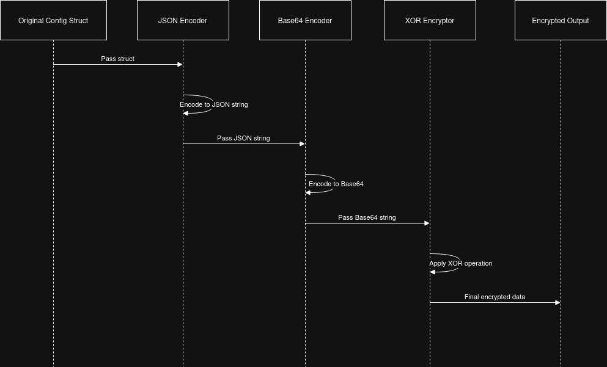
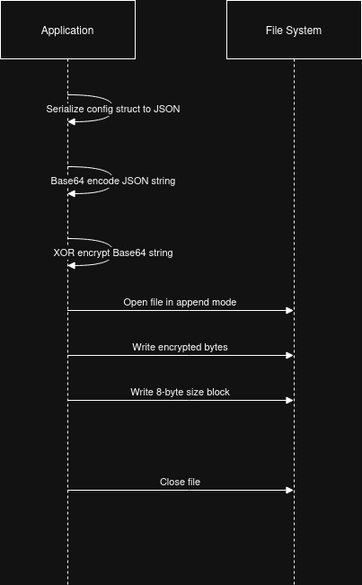
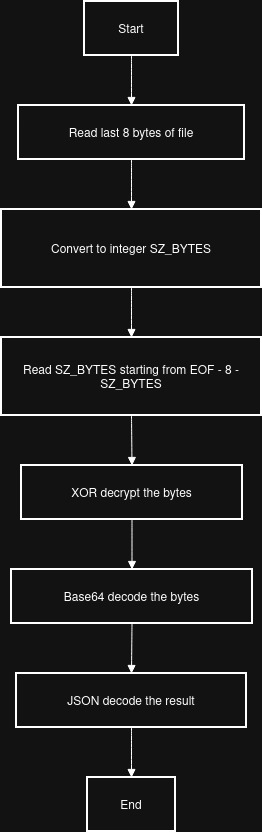

# CFGParser

## Overview

The purpose of this repository is to have a library that can read configuration data embedded in a file.

The configuration is expected to be embedded in an obfuscated format in the file. The configuration format is a JSON marshalled, base64-encoded, then encrypted byte package. To determine the size of the encrypted configruation, an 8 byte block is expected to be found immediately after the configuration bytes.

The valid encryption types are defined in `cfgparser_encryption`'s `EncryptionType` enum.

**_important note: this library does not handle the embedding of the configuration, only the extraction._**

### Embedding Process

This section describes the expected embedding process this library will reverse to extract the configuration.

#### General Process

1. JSON encode configuration structure defined in `cfgparser_core`'s `models` module.
1. Base64-encode the JSON-encoded structure without any padding.
1. Encrypt (using one of the valid methods) the base64-encoded string.
1. Take the length of the cipherbytes.
1. Pack the length of the cipherbytes into an 8-byte block.
1. Pack the cipherbytes and append the length block to it.
1. Move to the `end - (offset + len_packed)` position in the file or bytestream.
1. Write the cipherbytes and size block.

#### Packing Bytes Example

```python
cipherbytes = xor(base64(configuration),key)
l_cipher = len(cipherbytes)
data_block = struct.pack(f">{l_cipher}sQ", cipherbytes, l_cipher)
```

#### Example (Self-Embed, 0 Offset, XOR)



The encrypted output is then expected to be appended to the end of the original binary along with an 8 byte block holding the size of the encrypted packet.



This library reversed the process described/illustrated above to transform the configuration bytes into a configuration structure.

### Extract Process

#### General Process

1. Seek to end of file or bytes.
1. Seek back from end of file `8 + offset` bytes.
1. Read 8 bytes.
1. Convert 8 bytes to integer. This is the payload size (aka `sz_payload`).
1. Seek back from end of file `8 + offset + sz_payload`.
1. Read `sz_payload` bytes and save as `payload`.
1. Decrypt `payload` bytes. This is now a `base64-encoded` string.
1. Base64-decode the string. The JSON-encoded configuration is left.
1. JSON decode the string into a configuration object.

#### Example (Self-Embex, 0 Offset, XOR)


